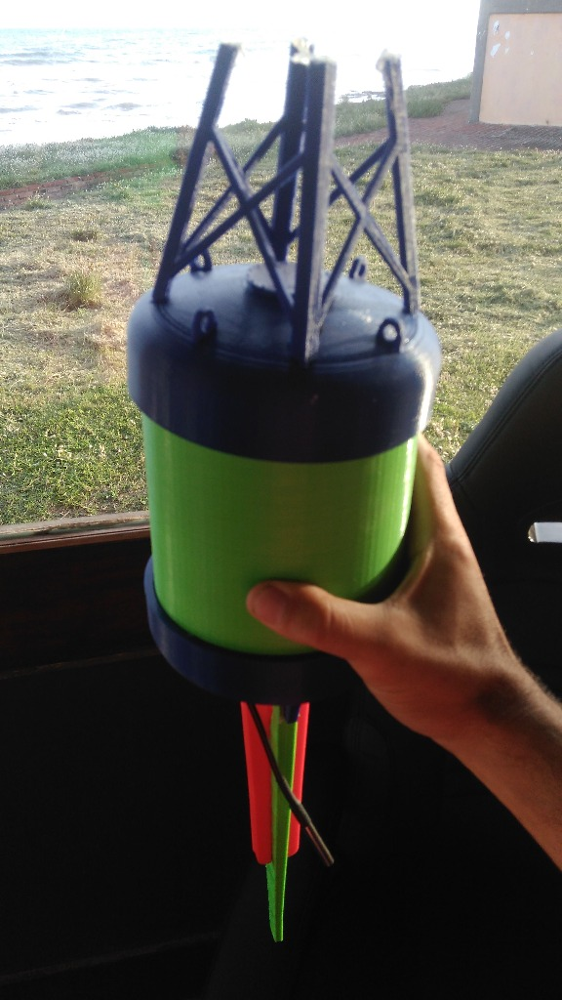

# BQS Buoy Network - Auditoría y Plan de Reconstrucción Arquitectónica
**Corte Tecnológico Histórico: 31 de Diciembre de 2018**



---

## 1. Inventario del Repositorio Actual
El directorio actual `d:\vm_117_meteoro\boya` contiene los siguientes artefactos:
- Archivos raíz: `.upptimerc.yml`, `.templaterc.json`, `LICENSE`, `README.md`.
- Directorios: `.git/`, `.github/workflows/` (8 workflows de CI/CD), `api/`, `assets/`, `graphs/`, `history/`.

## 2. Historial Git Actual
El árbol actual de Git posee commits fechados en febrero de 2022 originados por la plantilla de *Upptime*:
- `3cf522b` (2022-02-19): *Update .upptimerc.yml*
- `df905da` (2022-02-19): *Update README.md*
- `d3faba0` (2022-02-19): *Initial commit*
- Ramas: `master` y `gh-pages` (con commit `01732e0`).

## 3. Archivos que Pertenecen a Upptime
Los siguientes componentes corresponden exclusivamente al monitor de uptime serverless agregado con posterioridad:
- `.upptimerc.yml`, `.templaterc.json`
- `.github/workflows/*.yml` (`uptime.yml`, `response-time.yml`, `graphs.yml`, `site.yml`, `summary.yml`, `setup.yml`, `updates.yml`, `update-template.yml`)
- `history/*.yml` (`google.yml`, `wikipedia.yml`, `hacker-news.yml`, `test-broken-site.yml`, `summary.json`)
- `api/` y `graphs/`

## 4. Archivos a Preservar
- La foto real del prototipo físico (`docs/img/buoy_prototype_2018.jpg`), que documenta el diseño cilíndrico estanco, la torre/mástil de antena superior y la aleta de quilla inferior con el sensor sumergible DS18B20.
- La rama `master` original preservada como referencia histórica sin pérdida de datos.

---

## 5. Arquitectura Propuesta del Repositorio BQS 2018

```text
boya/
├── README.md                                  # Documentación técnica general del sistema BQS
├── LICENSE                                    # Licencia MIT (2018)
├── docs/                                      # Especificaciones de hardware y protocolos
│   ├── img/
│   │   └── buoy_prototype_2018.jpg            # Fotografía del prototipo físico real
│   ├── ARCHITECTURE.md                        # Red LoRa Mesh multi-hop y topología
│   ├── BQS_PROTOCOL.md                        # Especificación binaria de tramas de radio
│   ├── HARDWARE_PINOUT.md                     # Conexión eléctrica (Arduino + RFM95 + Sensores)
│   └── DATABASE_SCHEMA.md                     # Modelo relacional MySQL 5.7
│
├── firmware/
│   └── buoy-node/                             # Firmware embebido para las boyas oceánicas
│       ├── buoy-node.ino                      # Sketch principal (FSM: Sensor -> GPS -> LoRa Mesh -> Sleep)
│       ├── config.h                           # Identificadores de nodo, frecuencias LoRa (915 MHz), pines
│       ├── sensors/                           # Controladores de sensores
│       │   ├── dht_sensor.h / .cpp            # Sensor DHT22 / AM2302 (temperatura y humedad de aire)
│       │   ├── water_temperature.h / .cpp     # Sensor Dallas DS18B20 sumergible (OneWire)
│       │   └── battery.h / .cpp               # Divisor resistivo en ADC para monitoreo Li-ion / Plomo
│       ├── gps/                               # Posicionamiento satelital
│       │   └── gps_tracker.h / .cpp           # u-blox NEO-6M / NEO-M8N con NMEA y TinyGPS++
│       ├── radio/                             # Malla LoRa y enrutamiento
│       │   ├── lora_transceiver.h / .cpp      # Semtech SX1276/RFM95W sobre SPI
│       │   ├── mesh_manager.h / .cpp          # RadioHead RHMesh / RHRouter multi-hop
│       │   └── routing_table.h / .cpp         # Descubrimiento de rutas dinámicas y métrica de enlace
│       ├── storage/                           # Buffer circular de contingencia
│       │   └── telemetry_queue.h / .cpp       # Cola store-and-forward en EEPROM / Flash local
│       └── protocol/                          # Empaquetado binario
│           ├── bqs_packet.h                   # Estructura binaria compacta (32 bytes)
│           ├── bqs_packet.cpp                 # Serialización y deserialización
│           └── crc16.h / .cpp                 # Checksum CRC-CCITT (0x1021)
│
├── gateway/                                   # Software para estación base receptora (Raspberry Pi 3)
│   ├── README.md                              # Guía de despliegue en Linux / Raspbian
│   ├── config.ini                             # Configuración serial, credenciales API y coordenadas GW
│   ├── gateway.py                             # Bucle principal de escucha y retransmisión
│   ├── requirements.txt                       # pyserial, requests, sqlite3 (Python 3.5 / 3.6)
│   └── bqs_gateway/
│       ├── serial_receiver.py                 # Lectura continua del puerto serie del MCU receptor
│       ├── packet_decoder.py                  # Validación CRC y desempaquetado de telemetría binaria
│       ├── local_spool.py                     # Cola SQLite local para tolerancia a fallas de Internet/3G
│       ├── uploader.py                        # Cliente HTTP POST hacia BQS Server API
│       ├── beacon_broadcaster.py              # Emisión periódica de GATEWAY_BEACON por LoRa
│       └── heartbeat.py                       # Monitoreo de estado de la estación base
│
└── server/                                    # Plataforma web central de monitoreo BQS
    ├── database/
    │   └── schema.sql                         # Esquema MySQL 5.7 (tablas nodes, telemetry, gateways, etc.)
    ├── api/                                   # Backend REST en PHP 7.2
    │   ├── config.php                         # Conexión PDO MySQL y claves de autenticación
    │   ├── telemetry.php                      # Endpoint POST /api/v1/telemetry (con deduplicación)
    │   ├── nodes.php                          # Endpoints GET /api/v1/nodes y GET /api/v1/nodes/{id}
    │   ├── gateways.php                       # Endpoint POST /api/v1/gateways/heartbeat y GET
    │   └── alerts.php                         # Verificación de umbrales y registro de alarmas
    └── web/                                   # Panel de control web interactivo
        ├── index.html                         # Dashboard principal (Bootstrap 4, Leaflet 1.3.4)
        ├── css/
        │   └── styles.css                     # Estilos oscuros / náuticos
        └── js/
            ├── app.js                         # Lógica de actualización AJAX / polling
            ├── map_manager.js                 # Inicialización y renderizado de boyas, gateways y trazas GPS
            └── telemetry_charts.js            # Gráficos históricos de temperatura, batería y humedad
```

---

## 6. Verificación Tecnológica Histórica (Corte: 31/12/2018)

| Componente / Librería | Versión Seleccionada | Fecha de Lanzamiento | Estado de Cumplimiento |
| :--- | :--- | :---: | :---: |
| **RadioHead** | `v1.88` / `v1.86` | Agosto / Noviembre 2018 | Cumple estrictamente |
| **TinyGPS++** | `v1.0.2` | 2017 | Cumple estrictamente |
| **DallasTemperature / OneWire** | `v3.8.0` | 2017 | Cumple estrictamente |
| **DHT sensor library (Adafruit)** | `v1.3.0` | 2017 | Cumple estrictamente |
| **Python Gateway Stack** | Python 3.5 / 3.6 + `pyserial 3.4` + `requests 2.20` | 2017 / 2018 | Cumple estrictamente |
| **Sistema Operativo Servidor** | Ubuntu 18.04 LTS (Bionic Beaver) | Abril 2018 | Cumple estrictamente |
| **Stack Web Servidor** | PHP 7.2 + MySQL 5.7 + Apache 2.4 | 2017 / 2018 | Cumple estrictamente |
| **Frontend Mapas e Interfaz** | Leaflet 1.3.4 + Bootstrap 4.1.3 + jQuery 3.3.1 | 2018 | Cumple estrictamente |

---

## 7. Arquitectura del Firmware (Boyas LoRa Mesh)

Cada boya oceánica implementa una **Máquina de Estados Finitos (FSM)** sin dependencias bloqueantes:

```text
 ┌──────────────┐
 │     BOOT     │ ──> Inicialización de SPI, GPIOs, ADC y Sensores
 └──────┬───────┘
        ▼
 ┌──────────────┐
 │ SENSOR_READ  │ ──> Lectura DHT22 (Aire), DS18B20 (Agua), Divisor Batería (mV)
 └──────┬───────┘
        ▼
 ┌──────────────┐
 │ GPS_ACQUIRE  │ ──> Lectura NMEA u-blox (Lat, Lon, Alt, Satélites, HDOP)
 └──────┬───────┘
        ▼
 ┌──────────────┐
 │ BUILD_PACKET │ ──> Codificación binaria compacta (32 bytes con CRC16)
 └──────┬───────┘
        ▼
 ┌──────────────┐      ¿Ruta Activa a Gateway?
 │  FIND_ROUTE  │ ───► SI: Transmitir vía RHMesh a salto intermedio o directo
 └──────┬───────┘     NO: Guardar en cola local (Store-and-Forward)
        ▼
 ┌──────────────┐
 │   RADIO_RX   │ ──> Ventana de escucha para enrutamiento (Forwarding) de otras boyas
 └──────┬───────┘
        ▼
 ┌──────────────┐
 │  LOW_POWER   │ ──> Sleep profundo de bajo consumo hasta siguiente ciclo
 └──────────────┘
```

---

## 8. Arquitectura del Gateway (Raspberry Pi 3 + LoRa Hat)

El Gateway actúa como puente de desacople físico:
1. **Receptor Serial LoRa**: Lee tramas binarias validadas desde el transceiver RFM95W.
2. **Desempaquetador**: Decodifica las magnitudes físicas, añade metadatos del gateway (`gateway_id`, `rssi_gw`, `snr_gw`, `timestamp_gw`).
3. **Cola de Tolerancia a Fallas (SQLite Spool)**:
   - Si existe conexión a Internet, ejecuta `POST /api/v1/telemetry`.
   - Si se interrumpe la red 3G/Ethernet, persiste la muestra en la base SQLite local y la descarga automáticamente al restablecerse el enlace.
4. **Baliza de Red (Gateway Beacon)**: Difunde periódicamente un paquete `GATEWAY_BEACON` para que las boyas actualicen su árbol de saltos óptimo.

---

## 9. Arquitectura del Servidor Central BQS

- **Recepción REST**: Valida el token API de cada gateway y almacena las muestras.
- **Deduplicación Estricta**: La restricción `UNIQUE(node_id, sequence)` impide duplicados si una misma trama es recibida por múltiples gateways.
- **Motor de Alarmas**: Detecta batería baja ($<3.5\text{V}$), pérdida de señal GPS o desvíos térmicos extremos.
- **Panel Leaflet**: Dibuja en tiempo real las boyas activas, sus trayectorias geodésicas históricas y los enlaces de saltos LoRa hacia las estaciones costeras.

---

## 10. Especificación de la Trama Binaria de Radio BQS (32 Bytes)

```text
Offset  Campo               Tipo      Tamaño  Descripción
────────────────────────────────────────────────────────────────────────
0x00    magic               uint16_t  2 B     Identificador mágico (0xB05A)
0x02    version             uint8_t   1 B     Versión de protocolo (0x01)
0x03    type                uint8_t   1 B     Tipo de trama (0x01=TELEMETRY, 0x02=BEACON)
0x04    source_node         uint8_t   1 B     ID de la boya emisora original
0x05    destination         uint8_t   1 B     ID destino (0x00 = Broadcast / Gateway)
0x06    sequence            uint32_t  4 B     Número correlativo de paquete
0x0A    timestamp           uint32_t  4 B     Época UNIX o tiempo relativo (segundos)
0x0E    latitude_scaled     int32_t   4 B     Latitud * 10^7 (ej. -38.2728000 -> -382728000)
0x12    longitude_scaled    int32_t   4 B     Longitud * 10^7 (ej. -57.8306000 -> -578306000)
0x16    air_temp_c_x10      int16_t   2 B     Temperatura aire * 10 (21.5 °C -> 215)
0x18    humidity_pct_x10    uint16_t  2 B     Humedad relativa * 10 (75.4 % -> 754)
0x1A    water_temp_c_x10    int16_t   2 B     Temperatura agua * 10 (18.2 °C -> 182)
0x1C    battery_mv          uint16_t  2 B     Tensión de batería en milivoltios (3850 mV)
0x1E    satellites_hops     uint8_t   1 B     Nibble alto: Satélites (0-15), Nibble bajo: Hops
0x1F    ttl_flags           uint8_t   1 B     Bits 0-3: TTL restante, Bits 4-7: Flags estado
0x20    crc16               uint16_t  2 B     CRC-CCITT sobre los 30 bytes anteriores
────────────────────────────────────────────────────────────────────────
TOTAL: 34 bytes (Payload optimizado de alta penetración RF LoRa)
```

---

## 11. Modelo de Base de Datos Relacional (MySQL 5.7)

- `nodes`: Maestro de boyas (`id`, `hardware_id`, `name`, `type`, `status`, `battery_min_mv`, `created_at`, `last_seen_at`).
- `telemetry`: Registro histórico (`id`, `node_id`, `sequence`, `timestamp`, `latitude`, `longitude`, `altitude`, `temp_air`, `temp_water`, `humidity`, `battery_mv`, `battery_pct`, `satellites`, `hdop`, `rssi`, `snr`, `hop_count`, `gateway_id`, `received_at`). `UNIQUE KEY unq_node_seq (node_id, sequence)`.
- `gateways`: Estaciones receptoras costeras (`id`, `name`, `latitude`, `longitude`, `status`, `last_seen_at`, `ip`).
- `routes`: Mapa de topología y saltos (`id`, `source_node`, `gateway_id`, `hop_count`, `rssi`, `last_seen_at`).
- `alerts`: Registro de incidencias (`id`, `node_id`, `type`, `severity`, `message`, `resolved`, `created_at`).

---

## 12. Plan de Migración e Implementación Cronológica (2018)

1. **Paso 1 - Ramas y Estructura Base**:
   - Crear ramas `dev`, `feature/buoy-firmware`, `feature/lora-mesh`, `feature/gateway`, `feature/server-api`, `feature/map-dashboard`.
2. **Paso 2 - Firmware de Boya (`firmware/buoy-node/`)**:
   - Desarrollar librerías de sensores, empaquetado binario CRC16, cola circular store-and-forward y lógica RadioHead RHMesh.
3. **Paso 3 - Gateway Python (`gateway/`)**:
   - Implementar decodificador serie, spool SQLite, cliente HTTP y emisor de balizas.
4. **Paso 4 - Servidor Central (`server/`)**:
   - Esquema SQL MySQL 5.7, endpoints REST en PHP 7.2 y panel interactivo con mapas Leaflet 1.3.4.
5. **Paso 5 - Reconstrucción de Timeline Git (Año 2018)**:
   - Crear commits cronológicos fechados entre septiembre y diciembre de 2018, integrando las ramas de desarrollo y etiquetando la release `v1.0.0`.
