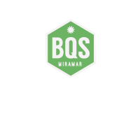

# Guía Técnica de Flasheo y Programación de Firmware - Boya BQS Miramar



Este documento detalla el procedimiento oficial para compilar, parametrizar y grabar el firmware en cada nodo boya (`BQS-NODE-XX`) utilizando el microcontrolador **ATmega328P** (Arduino Pro Mini / Nano) y el módem LoRa **HopeRF RFM95W (915 MHz)**.

---

## 1. Parámetros de Cada Dispositivo

Cada boya física requiere un identificador único en su cabecera `BQS_NODE_ID` (valor entre `1` y `254`) para el direccionamiento y enrutamiento en la malla LoRa.

| Parámetro | Definición en `config.h` | Valor / Rango |
| :--- | :--- | :---: |
| **Identificador de Nodo** | `#define BQS_NODE_ID` | `1` a `254` (ej. `17` para Miramar) |
| **Identificador de Red** | `#define BQS_NETWORK_ID` | `0x42` (Aislamiento de tráfico BQS) |
| **Frecuencia de Radio** | `#define LORA_FREQUENCY` | `915000000.0` (Banda ISM Argentina) |
| **Potencia de Transmisión** | `#define LORA_TX_POWER` | `20` dBm (100 mW con PA_BOOST) |
| **Límite de Saltos (TTL)** | `#define BQS_MAX_HOPS` | `6` saltos máximos |

---

## 2. Métodos de Flasheo

### Método A: Grabado mediante Bootloader Serial (FTDI / USB-UART)
Conectar el programador FTDI USB a los pines seriales del Arduino Pro Mini (`VCC`, `GND`, `TX`, `RX`, `DTR`).

```bash
# 1. Compilación mediante Arduino-CLI
arduino-cli compile --fqbn arduino:avr:pro:cpu=16MHzatmega328 \
  --build-property build.extra_flags="-DBQS_NODE_ID=17" \
  firmware/buoy-node

# 2. Grabado por puerto serie con avrdude
avrdude -v -p atmega328p -c arduino -P /dev/ttyUSB0 -b 115200 -D -U flash:w:buoy_node_17.hex:i
```

### Método B: Herramienta Automatizada Python BQS
El repositorio incluye la utilidad [`tools/flash_buoy_node.py`](../tools/flash_buoy_node.py):

```bash
# Flashear la boya #17 en el puerto /dev/ttyUSB0
python tools/flash_buoy_node.py --node-id 17 --port /dev/ttyUSB0 --frequency 915000000

# Flashear la boya #12 (Punta Hermengo) en Windows (COM3)
python tools/flash_buoy_node.py --node-id 12 --port COM3
```

---

## 3. Integración en el Panel Web BQS Miramar
Desde la pestaña **Estación de Flasheo de Firmware** en `http://localhost:8086`:
1. Seleccionar la boya deseada del listado.
2. Comprobar el comando generado en tiempo real.
3. Ejecutar la prueba de verificación de firmware para registrar el evento en el log de la boya.
